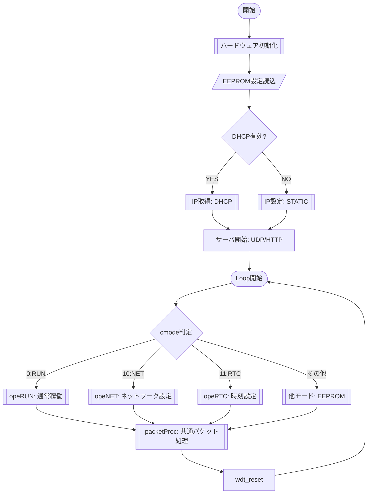

```mermaid
flowchart TD
    Start([開始]) --> Init[[ハードウェア初期化]]
    Init --> LoadEEPROM[/EEPROM設定読込/]
    
    LoadEEPROM --> DHCP{DHCP有効?}
    DHCP -- YES --> GetIP[[IP取得: DHCP]]
    DHCP -- NO --> SetStatic[[IP設定: STATIC]]
    
    GetIP --> ServerStart[サーバ開始: UDP/HTTP]
    SetStatic --> ServerStart
    
    ServerStart --> Loop([Loop開始])
    
    Loop --> Mode{cmode判定}
    
    %% 横並びを意識した配置
    Mode -- 0:RUN --> Run[[opeRUN: 通常稼働]]
    Mode -- 10:NET --> Net[[opeNET: ネットワーク設定]]
    Mode -- 11:RTC --> RTC[[opeRTC: 時刻設定]]
    Mode -- その他 --> Other[[他モード: EEPROM]]
    
    Run --> Packet[[packetProc: 共通パケット処理]]
    Net --> Packet
    RTC --> Packet
    Other --> Packet
    
    Packet --> WDT[wdt_reset]
    WDT --> Loop
```
