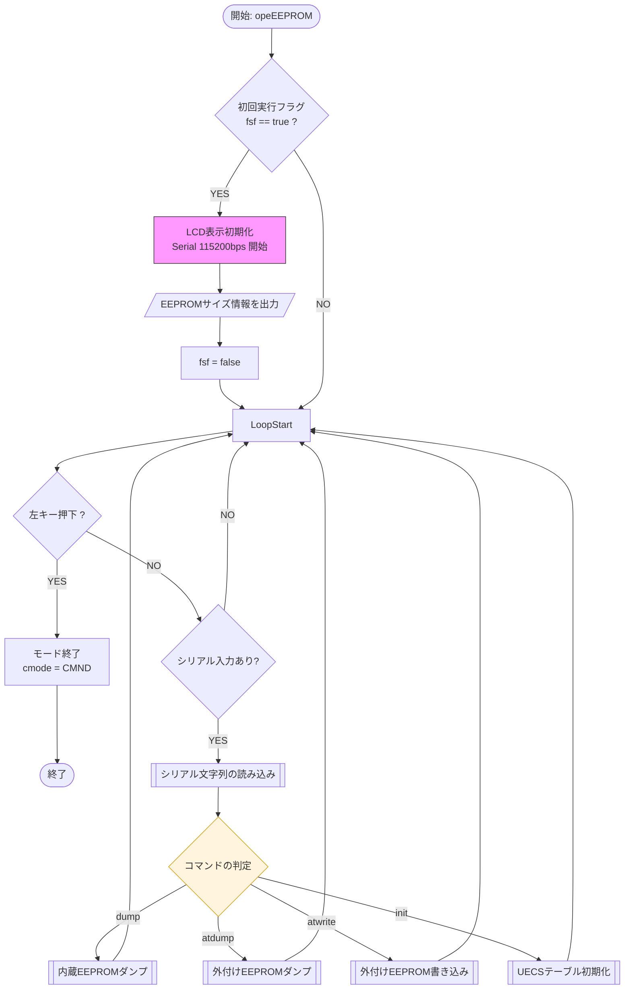

```mermaid
flowchart TD
    Start([開始: opeEEPROM]) --> InitCheck{初回実行フラグ<br/>fsf == true ?}
    
    %% 初期化
    InitCheck -- YES --> Setup[LCD表示初期化<br/>Serial 115200bps 開始]
    Setup --> PrintInfo[/EEPROMサイズ情報を出力/]
    PrintInfo --> ResetFlag[fsf = false]
    ResetFlag --> LoopStart
    
    %% メインループ
    InitCheck -- NO --> LoopStart
    LoopStart --> KeyCheck{左キー押下 ?}
    
    %% 終了処理
    KeyCheck -- YES --> Exit[モード終了<br/>cmode = CMND]
    Exit --> End([終了])
    
    %% コマンド受付
    KeyCheck -- NO --> SerialCheck{シリアル入力あり?}
    SerialCheck -- NO --> LoopStart
    
    SerialCheck -- YES --> ReadLine[[シリアル文字列の読み込み]]
    ReadLine --> CommandParse{コマンドの判定}
    
    %% 各コマンドの実行
    CommandParse -- "dump" --> Dump[[内蔵EEPROMダンプ]]
    CommandParse -- "atdump" --> ATDump[[外付けEEPROMダンプ]]
    CommandParse -- "atwrite" --> ATWrite[[外付けEEPROM書き込み]]
    CommandParse -- "init" --> TBLInit[[UECSテーブル初期化]]
    
    Dump --> LoopStart
    ATDump --> LoopStart
    ATWrite --> LoopStart
    TBLInit --> LoopStart

    style Setup fill:#f9f,stroke:#333
    style CommandParse fill:#fff4dd,stroke:#d4a017
```
