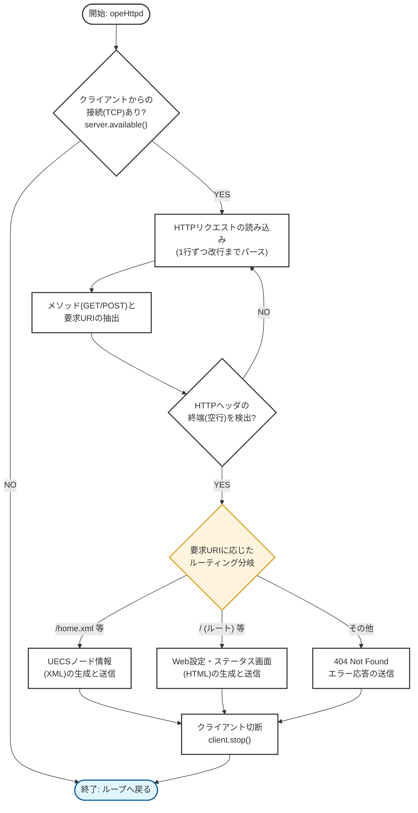

```mermaid
flowchart TD
    %% ノードのスタイル定義
    classDef default fill:#fff,stroke:#333,stroke-width:2px;
    classDef highlight fill:#fff4dd,stroke:#d4a017,stroke-width:2px;
    classDef result fill:#e1f5fe,stroke:#01579b,stroke-width:2px;

    Start(["開始: opeHttpd"]) --> CheckClient{"クライアントからの<br/>接続(TCP)あり?<br/>server.available()"}
    
    %% 接続がない場合はすぐに抜ける（ノンブロッキング）
    CheckClient -- NO --> End(["終了: ループへ戻る"]):::result
    
    %% クライアント接続時の処理
    CheckClient -- YES --> ReadReq["HTTPリクエストの読み込み<br/>(1行ずつ改行までパース)"]
    ReadReq --> ParseURI["メソッド(GET/POST)と<br/>要求URIの抽出"]
    
    %% 空行（リクエストヘッダの終了）まで読み飛ばす等の処理後、分岐
    ParseURI --> CheckBlankLine{"HTTPヘッダの<br/>終端(空行)を検出?"}
    CheckBlankLine -- NO --> ReadReq
    CheckBlankLine -- YES --> RouteURI{"要求URIに応じた<br/>ルーティング分岐"}:::highlight
    
    %% 各エンドポイントへの分岐（※実装に合わせて調整可能です）
    RouteURI -- "/home.xml 等" --> SendXML["UECSノード情報<br/>(XML)の生成と送信"]
    RouteURI -- "/ (ルート) 等" --> SendHTML["Web設定・ステータス画面<br/>(HTML)の生成と送信"]
    RouteURI -- "その他" --> Send404["404 Not Found<br/>エラー応答の送信"]
    
    SendXML --> CloseConnection
    SendHTML --> CloseConnection
    Send404 --> CloseConnection
    
    %% 切断処理
    CloseConnection["クライアント切断<br/>client.stop()"] --> End
```