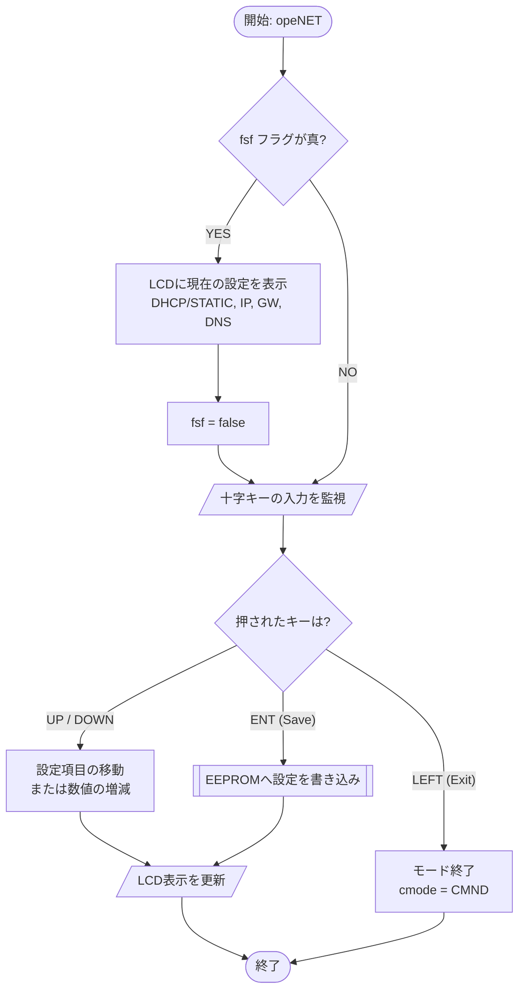

```mermaid
flowchart TD
    Start([開始: opeNET]) --> Init{fsf フラグが真?}
    
    %% 初期表示
    Init -- YES --> ShowUI[LCDに現在の設定を表示<br/>DHCP/STATIC, IP, GW, DNS]
    ShowUI --> ResetFlag[fsf = false]
    ResetFlag --> KeyWait
    
    %% 入力ループ
    Init -- NO --> KeyWait[/十字キーの入力を監視/]
    KeyWait --> KeyType{押されたキーは?}
    
    %% キー別の処理
    KeyType -- "UP / DOWN" --> Move[設定項目の移動<br/>または数値の増減]
    KeyType -- "LEFT (Exit)" --> Exit[モード終了<br/>cmode = CMND]
    KeyType -- "ENT (Save)" --> Save[[EEPROMへ設定を書き込み]]
    
    %% 画面更新
    Move --> UpdateLCD[/LCD表示を更新/]
    Save --> UpdateLCD
    
    UpdateLCD --> End([終了])
    Exit --> End
```
