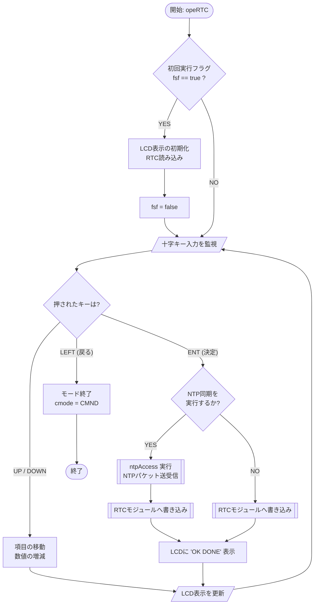

```mermaid
flowchart TD
    Start([開始: opeRTC]) --> CheckInit{初回実行フラグ<br/>fsf == true ?}
    
    %% 初期化フェーズ
    CheckInit -- YES --> InitUI[LCD表示の初期化<br/>RTC読み込み]
    InitUI --> SetFlag[fsf = false]
    SetFlag --> KeyLoop
    
    %% 入力待ちループ
    CheckInit -- NO --> KeyLoop[/十字キー入力を監視/]
    KeyLoop --> KeyType{押されたキーは?}
    
    %% 各キーの分岐
    KeyType -- "UP / DOWN" --> Edit[項目の移動<br/>数値の増減]
    KeyType -- "ENT (決定)" --> NTPChoice{NTP同期を<br/>実行するか?}
    KeyType -- "LEFT (戻る)" --> Exit[モード終了<br/>cmode = CMND]

    %% NTP同期処理
    NTPChoice -- YES --> NTP[[ntpAccess 実行<br/>NTPパケット送受信]]
    NTP --> SaveRTC[[RTCモジュールへ書き込み]]
    SaveRTC --> ShowDone[LCDに 'OK DONE' 表示]
    
    %% 手動修正後の保存（ENTキー押下時）
    NTPChoice -- NO --> ManualSave[[RTCモジュールへ書き込み]]
    ManualSave --> ShowDone

    Edit --> UpdateLCD[/LCD表示を更新/]
    ShowDone --> UpdateLCD
    UpdateLCD --> KeyLoop
    Exit --> End([終了])
```
