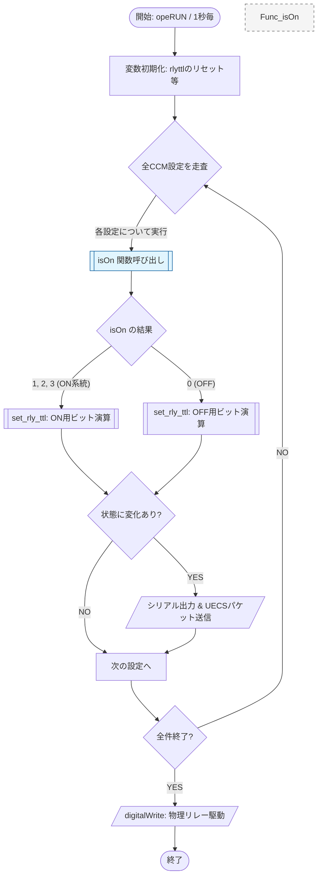

```mermaid
flowchart TD
    Start([開始: opeRUN / 1秒毎]) --> Init[変数初期化: rlyttlのリセット等]
    
    %% Loop処理のイメージ
    Init --> LoopStart{全CCM設定を走査}
    LoopStart -- 各設定について実行 --> IsOnCall[[isOn 関数呼び出し]]

    %% 判定後の処理
    IsOnCall --> Judge{isOn の結果}
    Judge -- "1, 2, 3 (ON系統)" --> CalcON[[set_rly_ttl: ON用ビット演算]]
    Judge -- "0 (OFF)" --> CalcOFF[[set_rly_ttl: OFF用ビット演算]]

    CalcON --> Compare{状態に変化あり?}
    CalcOFF --> Compare
    
    Compare -- YES --> Log[/シリアル出力 & UECSパケット送信/]
    Compare -- NO --> Next
    
    Log --> Next[次の設定へ]
    Next --> LoopEnd{全件終了?}
    LoopEnd -- NO --> LoopStart
    LoopEnd -- YES --> PhysicalOut[/digitalWrite: 物理リレー駆動/]
    
    PhysicalOut --> End([終了])

    %% スタイル定義
    style Func_isOn fill:#f5f5f5,stroke:#666,stroke-dasharray: 5 5
    style IsOnCall fill:#e1f5fe,stroke:#01579b
```
