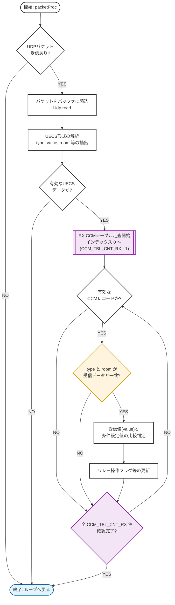

```mermaid
flowchart TD
    %% ノードのスタイル定義
    classDef default fill:#fff,stroke:#333,stroke-width:2px;
    classDef highlight fill:#fff4dd,stroke:#d4a017,stroke-width:2px;
    classDef result fill:#e1f5fe,stroke:#01579b,stroke-width:2px;
    classDef loopbg fill:#f3e5f5,stroke:#8e24aa,stroke-width:2px;

    Start(["開始: packetProc"]) --> CheckUDP{"UDPパケット<br/>受信あり?"}
    
    %% パケットがない場合はすぐに抜ける（ノンブロッキング）
    CheckUDP -- NO --> End(["終了: ループへ戻る"]):::result
    
    %% パケット受信処理
    CheckUDP -- YES --> ReadUDP["パケットをバッファに読込<br/>Udp.read"]
    ReadUDP --> ParseXML["UECS形式の解析<br/>type, value, room 等の抽出"]
    
    ParseXML --> CheckValid{"有効なUECS<br/>データか?"}
    CheckValid -- NO --> End
    
    %% RX CCMテーブルとの照合ループ
    CheckValid -- YES --> LoopCCMStart[["RX CCMテーブル走査開始<br/>インデックス 0 〜 (CCM_TBL_CNT_RX - 1)"]]:::loopbg
    
    LoopCCMStart --> CheckCCM{"有効な<br/>CCMレコードか?"}
    
    CheckCCM -- NO --> LoopCCMNext
    
    CheckCCM -- YES --> MatchType{"type と room が<br/>受信データと一致?"}:::highlight
    
    MatchType -- NO --> LoopCCMNext
    
    %% 条件一致時の処理
    MatchType -- YES --> EvalCondition["受信値(value)と<br/>条件設定値の比較判定"]
    EvalCondition --> UpdateRelay["リレー操作フラグ等の更新"]
    UpdateRelay --> LoopCCMNext
    
    %% ループ終端
    LoopCCMNext{"全 CCM_TBL_CNT_RX 件<br/>確認完了?"}:::loopbg
    LoopCCMNext -- NO --> CheckCCM
    
    LoopCCMNext -- YES --> End
```
