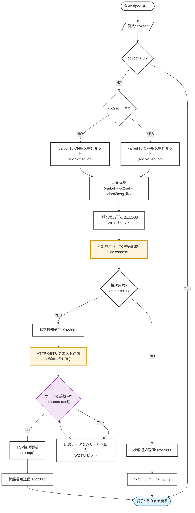

```mermaid
flowchart TD
    %% ノードのスタイル定義
    classDef default fill:#fff,stroke:#333,stroke-width:2px;
    classDef highlight fill:#fff4dd,stroke:#d4a017,stroke-width:2px;
    classDef result fill:#e1f5fe,stroke:#01579b,stroke-width:2px;
    classDef loopbg fill:#f3e5f5,stroke:#8e24aa,stroke-width:2px;

    Start(["開始: opeABCO2"]) --> Input[/"引数: co2set"/]
    
    %% ガード句
    Input --> CheckNeg{"co2set < 0 ?"}
    CheckNeg -- YES --> End(["終了: そのまま戻る"]):::result
    
    %% 文字列セット
    CheckNeg -- NO --> CheckZero{"co2set == 0 ?"}
    CheckZero -- YES --> SetOff["varbuf に OFF用文字列セット<br/>(abco2msg_off)"]
    CheckZero -- NO --> SetOn["varbuf に ON用文字列セット<br/>(abco2msg_on)"]
    
    %% URL構築
    SetOff --> BuildURL
    SetOn --> BuildURL
    BuildURL["URL構築<br/>(varbuf + co2set + abco2msg_fix)"] --> SendStart["状態通知送信: 0x22000<br/>WDTリセット"]
    
    %% 接続試行
    SendStart --> Connect["外部ホストへTCP接続試行<br/>ec.connect"]:::highlight
    Connect --> CheckResult{"接続成功?<br/>(result == 1)"}
    
    %% 接続失敗時
    CheckResult -- NO --> SendFail["状態通知送信: 0x22003"]
    SendFail --> PrintErr["シリアルへエラー出力"]
    PrintErr --> End
    
    %% 接続成功時
    CheckResult -- YES --> SendConn["状態通知送信: 0x22001"]
    SendConn --> SendReq["HTTP GETリクエスト送信<br/>(構築したURL)"]:::highlight
    
    SendReq --> WaitRes{"サーバと接続中?<br/>ec.connected()"}:::loopbg
    
    WaitRes -- YES --> ReadData["応答データをシリアルへ出力<br/>WDTリセット"]
    ReadData --> WaitRes
    
    WaitRes -- NO --> Disconnect["TCP接続切断<br/>ec.stop()"]
    Disconnect --> SendEnd["状態通知送信: 0x22002"]
    SendEnd --> End
```
