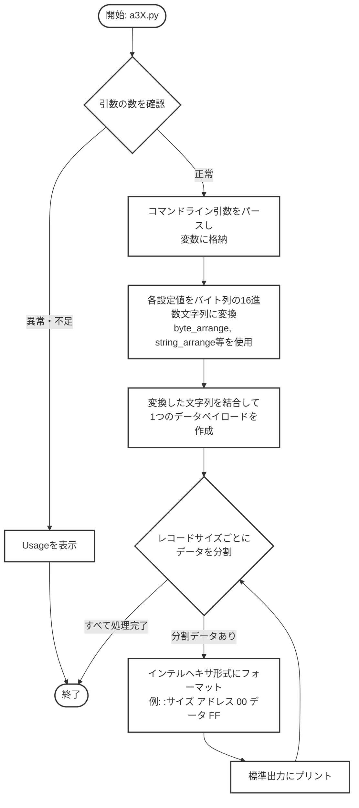

```mermaid
flowchart TD
    %% ノードのスタイル定義
    classDef default fill:#fff,stroke:#333,stroke-width:2px;
    classDef highlight fill:#fff4dd,stroke:#d4a017,stroke-width:2px;
    classDef result fill:#e1f5fe,stroke:#01579b,stroke-width:2px;

    Start(["開始: a3X.py"]) --> IsArgs{"引数の数を確認"}
    IsArgs -- 正常 --> Parse[コマンドライン引数をパースし<br/>変数に格納]
    Parse --> Convert[各設定値をバイト列の16進数文字列に変換<br/>byte_arrange, string_arrange等を使用]
    IsArgs -- 異常・不足 --> Usage[Usageを表示]
    Usage --> End([終了])
    Convert --> Concat[変換した文字列を結合して<br/>1つのデータペイロードを作成]
    Concat -->LoopHex{レコードサイズごとに<br/>データを分割}
    LoopHex -- 分割データあり --> FormatHex[インテルヘキサ形式にフォーマット<br/>例: :サイズ アドレス 00 データ FF]
    FormatHex -->Print[標準出力にプリント]
    Print --> LoopHex
    LoopHex --すべて処理完了 --> End([終了])

```