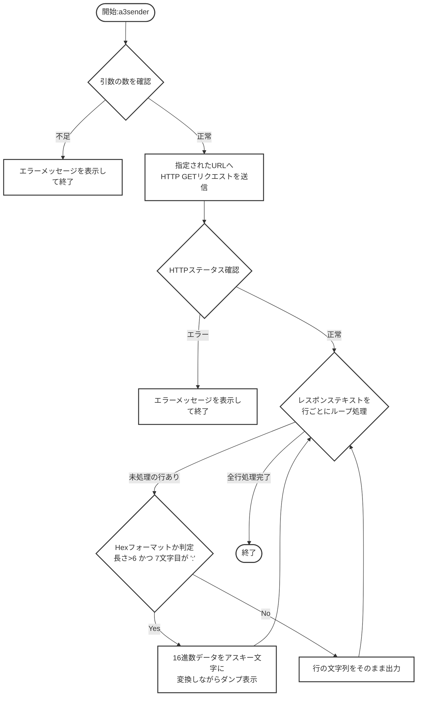

```mermaid
flowchart TD
    %% ノードのスタイル定義
    classDef default fill:#fff,stroke:#333,stroke-width:2px;
    classDef highlight fill:#fff4dd,stroke:#d4a017,stroke-width:2px;
    classDef result fill:#e1f5fe,stroke:#01579b,stroke-width:2px;
        S_Start([開始:a3sender]) --> S_CheckArgs{引数の数を確認}
        S_CheckArgs -- 不足 --> S_Usage[エラーメッセージを表示して終了]
        S_CheckArgs -- 正常 --> S_Req[指定されたURLへ<br/>HTTP GETリクエストを送信]
        S_Req --> S_CheckHTTP{HTTPステータス確認}
        S_CheckHTTP -- エラー --> S_Error[エラーメッセージを表示して終了]
        S_CheckHTTP -- 正常 --> S_LoopLines{レスポンステキストを<br/>行ごとにループ処理}
        S_LoopLines -- 未処理の行あり --> S_CheckFmt{Hexフォーマットか判定<br/>長さ>6 かつ 7文字目が ':'}
        S_CheckFmt -- Yes --> S_Dump[16進数データをアスキー文字に<br/>変換しながらダンプ表示]
        S_Dump --> S_LoopLines
        S_CheckFmt -- No --> S_PrintRaw[行の文字列をそのまま出力]
        S_PrintRaw --> S_LoopLines
        S_LoopLines -- 全行処理完了 --> S_End([終了])

```